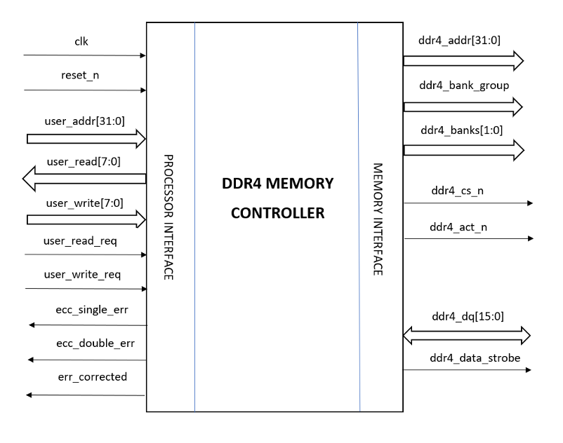
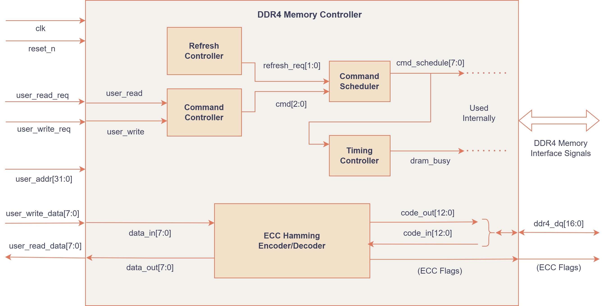
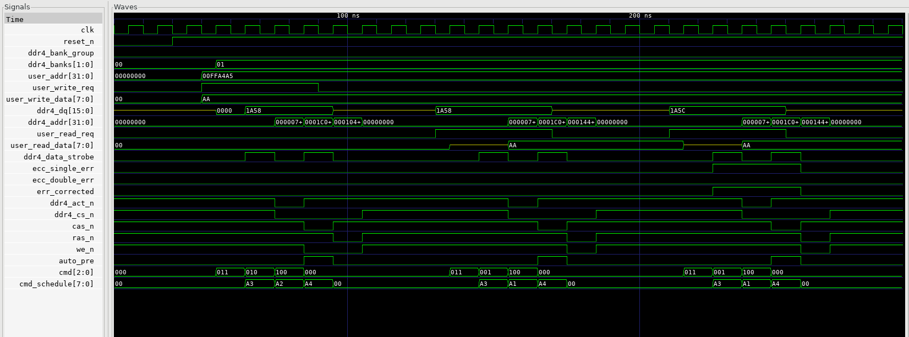
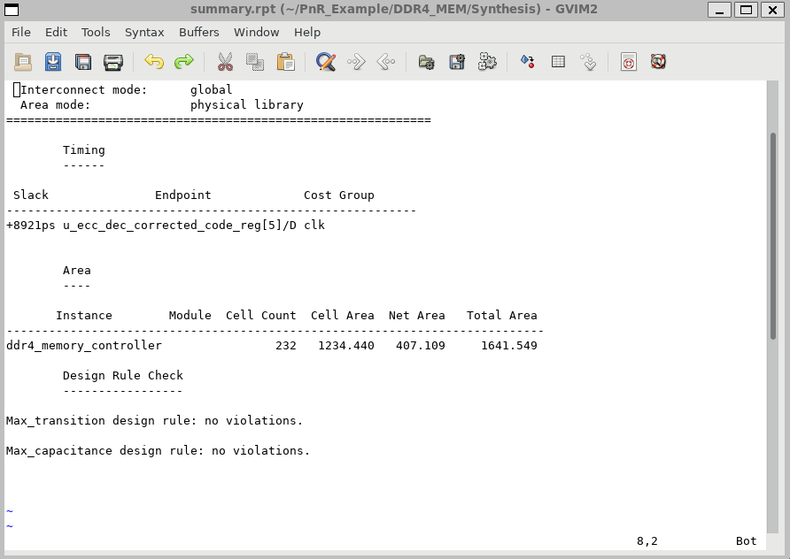
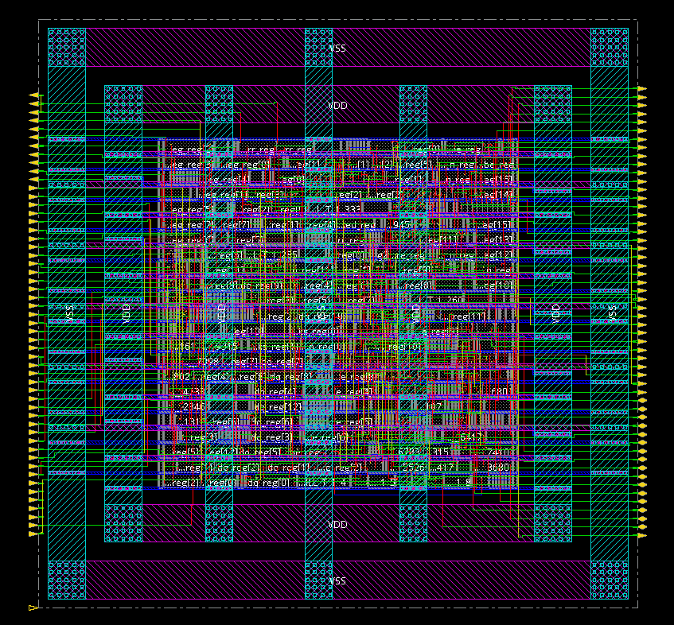

# DDR4 Memory Controller IP 

## Technical Specification :
The DDR4 controller has been designed with a set of hardware and functional specifications that govern its speed, interface configuration, memory addressing, and error handling capabilities. These parameters ensure correct operation with the targeted DDR4 DRAM device and optimal system performance.

- Target Clock frequency: **100 MHz [Max: 1.8 GHz]**
- User Data Bus width: **8 bits**
- User Address width: **32 bits**
- Designed to access a **2 GB DRAM Memory** (2 Bank Groups, 4 Banks each)
- Controller designed for **x16 configuration of DDR4 DRAM Memory** (16-bit DQ)
- **16-bit Read/Write DQ Bus** implemented
- **ECC Hamming (13,8)** implemented for parity/error correction
- Supports **Single Error Correction (SEC)** and **Double Error Detection (DED)** to maintain data integrity
- Read/Write operations executed based on input User Flags
- Auto-Precharge command asserted to the memory compulsorily after every Read/Write operation
- Periodic Memory Refresh performed to maintain DRAM data integrity (Entire memory refreshed at once)
- As per DDR4 Specification, to support dual data rate, the controller should work on differential clock inputs (CK t, CK c). But, we have implemented a high level DDR4 Memory Controller (commands, timing, refresh, ECC) and considered a single clock for the ease of implementation.

---

## Block Diagram

---

## Top Module Ports

| Port Name | Width | Type | Description |
|-----------|--------|--------|-------------|
| clk | 1 | input | System clock |
| reset_n | 1 | input | Asynchronous active reset |
| user_addr | 32 | input | Address bus from CPU |
| user_read_req | 1 | input | Read request from CPU |
| user_read | 8 | output | Data read from memory |
| user_write_req | 1 | input | Write request from CPU |
| user_write | 8 | input | Data to be written |
| ddr4_addr | 32 | output | Controller address to Memory |
| ddr4_bank_group | 1 | output | Bank Group address |
| ddr4_banks | 2 | output | Bank address |
| ddr4_dq | 16 | inout | Data bus between Controller and Memory |
| ddr4_data_strobe | 1 | output | Data strobe signal |
| ddr4_cs_n | 1 | output | Active-low chip select |
| ddr4_act_n | 1 | output | Active-low ACTIVATE signal |
| ecc_single_err | 1 | output | ECC single error detection |
| ecc_double_err | 1 | output | ECC double error detection |
| ecc_corrected | 1 | output | ECC single error corrected |

---

## Verilog Modules Flow

---

## RTL Simulation

The DDR4 Memory Controller testbench is designed to verify the correctness of the ECC-enabled read and write operations. The following test cases were performed:

### Write Operation

A standard write transaction is performed, where the controller generates the corresponding Hamming (13,8) ECC bits for the input data before storing it in DRAM.

- **Input Data:** `8'hAA`
- **Encoded DRAM Data:** `16'h1A58`

### Read Operation

The controller reads an ECC-encoded value from DRAM, decodes the data, and returns the original user data.

- **Encoded DRAM Data:** `16'h1A58`
- **Data Returned to CPU:** `8'hAA`

### Single-Bit Error Correction

A single-bit error is intentionally injected into the stored DRAM data to validate the error detection and correction capability of the ECC logic. The controller successfully detects the error, corrects it, and returns the original data.

- **Corrupted DRAM Data:** `16'h1A5C`
- **Error Status:** Single-bit error detected and corrected
- **Data Returned to CPU:** `8'hAA`

---

## Synthesis Report

---

## Maximum Operating Frequency

The DDR4 Memory Controller was synthesized for a target frequency of **100 MHz**, where the design exhibits a large positive slack of **+8.9 ns**, indicating good timing margins. To determine the maximum achievable performance, the clock period was progressively reduced and timing was re-evaluated using synthesis timing reports. The slack steadily decreases as the operating frequency increases, approaching marginal values around **1 GHz** and reaching **zero** between **1.25 GHz and 1.8 GHz**. This region represents the timing limit where the critical path delay equals the clock period.

Beyond **1.85 GHz**, the design begins to violate timing requirements, with negative slack values observed and reaching **−32 ps at 2 GHz**. Based on this analysis, the **maximum stable operating frequency** of the DDR4 Memory Controller is approximately **1.8 GHz**.

### Timing Analysis Results

| Clock Frequency (GHz) | Clock Period (ns) | Slack (ps) | Timing Status |
|----------------------|-------------------|-------------|---------------|
| 0.20 (200 MHz) | 5.00 | +3212 | Met |
| 0.10 (100 MHz) | 10.00 | +8921 | Met |
| 1.00 | 1.00 | +4 | Met (borderline) |
| 1.25 | 0.80 | 0 | Limit |
| 1.40 | 0.70 | 0 | Limit |
| 1.66 | 0.60 | 0 | Limit |
| **1.80** | **0.55** | **0** | **Max Stable Frequency** |
| 1.85 | 0.54 | -6 | Violated |
| 1.92 | 0.52 | -17 | Violated |
| 2.00 | 0.50 | -32 | Violated |

**Maximum Stable Operating Frequency:** **1.8 GHz**

---
## Physical Design Layout

